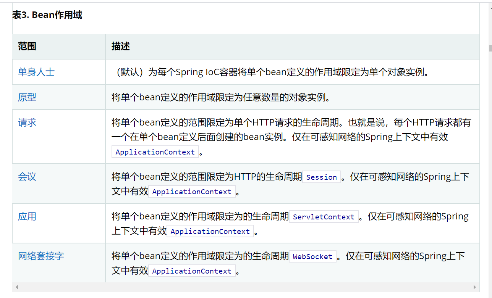

# 1、Spring

## 1.1、简介

+ Spring：春天----->给软件行业带来了春天
+ 2002，首次推出了Spring框架的雏形：interface21框架
+ Spring框架即以interface21框架为基础，经过重新设计，并不断丰富其内涵，于2004年3月24日发布了1.0正式版。
+ Rod Johnson，SpringFramework创始人，专业：音乐。
+ Spring理念：使现有的技术更加容易使用，本身是一个大杂烩，整合了现有的技术框架。


* SSH：Struct2 + Spring + Hibernate
* SSM：SpringMVC + Spring + Mybatis


官网：<https://spring.io/projects/spring-framework#overview>

官方下载地址：<https://repo.spring.io/release/org/springframework/spring/>

GitHub：<https://github.com/spring-projects/spring-framework>

SpringIOC和AOP官方文档<https://docs.spring.io/spring-framework/docs/current/spring-framework-reference/core.html>


```xml
<!-- https://mvnrepository.com/artifact/org.springframework/spring-webmvc -->
<dependency>
    <groupId>org.springframework</groupId>
    <artifactId>spring-webmvc</artifactId>
    <version>5.2.8.RELEASE</version>
</dependency>
<!-- https://mvnrepository.com/artifact/org.springframework/spring-webmvc -->
<dependency>
    <groupId>org.springframework</groupId>
    <artifactId>spring-jdbc</artifactId>
    <version>5.2.8.RELEASE</version>
</dependency>
```


常用依赖

```xml
<dependency>
   <groupId>junit</groupId>
   <artifactId>junit</artifactId>
   <version>4.12</version>
   <scope>test</scope>
</dependency>
```


## 1.2、优点

* Spring是一个开源的免费的框架（容器）！
* Spring是一个轻量级、非入侵式的框架！
* ==控制反转（IOC），面向切面（AOP）==
* 支持事务的处理，对框架整合的支持！

**==总结一句话：Spring就是一个轻量级的控制反转（IOC）和面向切面变成（AOP）框架！==**


##  1.3、组成


## 1.4、拓展

在Spring的官网有这个介绍：现代化的Java开发！说白就是基于Spring的开发！


* Spring Boot

  - 一个快速开发的脚手架
  - 基于SpringBoot可以快速开发单个微服务
  - 约定大于配置！

* SpringCloud

  - SpringCloud是基于SpringBoot实现的。

  

  大多数公司都在使用SpringBoot进行快速开发，学习SpringBoot的前提，需要完全掌握Spring及SpringMVC！承上启下的作用！

  

  **弊端：发展了太久之后，违背了原来的理念，配置太过繁琐！**

  


# 2、理论推导

1. UserDao接口
2. UserDaoImpl实现类
3. UserService业务层
4. UserServiceImpl业务实现类

## 2.1原始的方法

```java
//dao层接口
package dao;

public interface UserDao {
    void getUser();
}

package dao;

//dao实现类
public class UserDaoImpl implements UserDao{
    public void getUser() {
        System.out.println("默认获取用户的数据");

    }
}

//dao实现类2
package dao;

public class UserDaoMysqlImpl implements UserDao{

    public void getUser() {
        System.out.println("Mysql获取用户的数据");
    }
}

//service接口，业务层
package service;

public interface UserService {
    void getUser();
}


//service实现类
package service;

import dao.UserDao;
import dao.UserDaoImpl;
import dao.UserDaoMysqlImpl;

public class UserServiceImpl implements UserService {

//    private UserDao userDao= new UserDaoImpl();
    //如果要增加一个实现的话，就要修改原来的代码
    private UserDao userDao = new UserDaoMysqlImpl();
    public void getUser() {
        userDao.getUser();
    }
}

//测试方法
import service.UserService;
import service.UserServiceImpl;

public class MyTest {
    public static void main(String[] args) {
        //原始的方法，service是业务层
        //用户实际调用的是业务层，dao层他们不需要接触
        UserService userService = new UserServiceImpl();
        userService.getUser();
    }
}


```

在我们之前的业务中，用户的需求可能会影响我们的原来的代码，我们需要根据用户去修改原代码！如果

程序代码量十分大，修改一次的成本代价十分昂贵。


使用一个Set接口实现，已经发生了革命性的变化

```java
public class UserServiceImpl implements UserService {

//    private UserDao userDao= new UserDaoImpl();
//如果要增加一个实现的话，就要修改原来的代码
//    private UserDao userDao = new UserDaoMysqlImpl();
    //利用set进行动态实现值的注入
    private UserDao userDao;
    public void setUserDao(UserDao userDao){
        this.userDao = userDao;
    }
    public void getUser() {
        userDao.getUser();
    }
}


import dao.UserDaoImpl;
import service.UserService;
import service.UserServiceImpl;

public class MyTest {
    public static void main(String[] args) {
        //原始的方法，service是业务层
        //用户实际调用的是业务层，dao层他们不需要接触
        UserService userService = new UserServiceImpl();
        ((UserServiceImpl) userService).setUserDao(new UserDaoImpl());
        userService.getUser();
    }
}
```

* 之前程序是主动创建对象！控制权在程序员手上！
* 使用了set注入后，程序不再具有主动性，而是变成了被动接受对象。

这种思想，从本质上解决了问题，我们程序员不用再去管理对象的创建了。系统的耦合性大大降低，可以更加专注的在业务的实现上。这是IOC的原型！（控制反转）


## 2.2、思考问题

1. Hello对象是谁创建的？
       spring创建的
2. Hello对象属性是怎么设置的？
       Hello对象的属性是由Spring容器设置的

这个过程就叫控制反转：

* ==控制==：谁来控制对象的创建，传统应用程序的对象是由程序本身控制创建的，使用spring后，对象是由spring来创建的。
* ==反转==：程序本身不创建对象，而变成被动的接受对象。
* ==依赖注入==：就是利用set方法来进行注入的。
* IOC是一种编程思想，由主动编程变成被动接受。
* 可以通过newClassPathXmlApplicationContext去浏览一下底层源码。

**到了这里，我们就不用在程序中去改动了，要实现不同的操作，只需要在xml配置文件中进行修改，所谓IOC，一句话搞定：对象由Spring来创建，管理，装配！**

## 2.3、通过xml配置的一些实例

### 2.3.1 实例1（HelloSpring）

Hello.class

```java
package pojo;

public class Hello {
    private String str;

    public String getStr() {
        return str;
    }
    //必须要有set方法，不然会报错，
    public void setStr(String str) {
        this.str = str;
    }

    @Override
    public String toString() {
        return "Hello{" +
                "str='" + str + '\'' +
                '}';
    }
}
```


MyTest.class

```java
import org.springframework.context.ApplicationContext;
import org.springframework.context.support.ClassPathXmlApplicationContext;
import pojo.Hello;

public class MyTest {
    public static void main(String[] args) {
        //必须写这句话，而且是固定的，后面可以传一个或多个xml文件
        //获取spring的上下文对象
        //ClassPathXmlApplicationContext用xml获取 3,拿到spring的容器
        ApplicationContext context = new ClassPathXmlApplicationContext("bean.xml");
        //我们的对象现在都在spring中管理了，我们要使用，直接去里面拿就可以了
        Hello hello = (Hello)context.getBean("hello");
        System.out.println(hello.toString());

    }
}
```


bean.xml

```xml
<?xml version="1.0" encoding="UTF-8"?>
<beans xmlns="http://www.springframework.org/schema/beans"
       xmlns:xsi="http://www.w3.org/2001/XMLSchema-instance"
       xsi:schemaLocation="http://www.springframework.org/schema/beans
        https://www.springframework.org/schema/beans/spring-beans.xsd">
    <!--    使用spring来创建对象，在spring这些都称为bean
    原来java：
    类型 变量名 = new 类型（）；
    Hello hello = new Hello（）；

    交给spring之后：
    bean = 对象  new Hello（）；
    id = 变量名
    class = new 的对象；类的路径
    property 相当于给对象中的属性设置一个值！
    -->
    <bean id="hello" class="pojo.Hello">
        <property name="str" value="Spring"/>
    </bean>
</beans>
```

### 2.3.2、实例2（上面原始方法的优化）

bean.xml文件

```xml
<?xml version="1.0" encoding="UTF-8"?>
<beans xmlns="http://www.springframework.org/schema/beans"
       xmlns:xsi="http://www.w3.org/2001/XMLSchema-instance"
       xsi:schemaLocation="http://www.springframework.org/schema/beans
        https://www.springframework.org/schema/beans/spring-beans.xsd">
    <bean id="mysqlImpl" class = "dao.UserDaoMysqlImpl"/>
    <!--    ref:引用Spring容器中创建好的对象
    value：具体的值，基本数据类型-->

    <bean id="UserServiceImpl" class="service.UserServiceImpl">
        <property name="userDao" ref="mysqlImpl"/>
    </bean>
</beans>
```


MyTest.class文件

```java
import dao.UserDaoImpl;
import org.springframework.context.ApplicationContext;
import org.springframework.context.support.ClassPathXmlApplicationContext;
import service.UserService;
import service.UserServiceImpl;

public class MyTest {
    public static void main(String[] args) {

        //获取ApplicationContext,拿到Spring容器
        ApplicationContext context = new ClassPathXmlApplicationContext("bean.xml");

        //需要什么就直接get什么（通过xml文件中的bean）
        UserServiceImpl userServiceImpl = (UserServiceImpl)context.getBean("UserServiceImpl");
        userServiceImpl.getUser();
    }
}

```

主要变化的就是这两个文件。

## 2.4、XML配置文件

### 2.4.1、bean的用法

* 使用spring来创建对象，在spring这些都称为bean
      原来java：
      类型 变量名 = new 类型（）；
      Hello hello = new Hello（）；
* 交给spring之后：
  bean = 对象  new Hello（）；
  id = 变量名
  class = new 的对象；类的路径
  property 相当于给对象中的属性设置一个值！
* ==ref==: 引用Spring容器中创建好的对象
*  ==value==：具体的值，基本数据类型


### 2.4.2、基于XML的配置元数据的基本结构

```xml
<?xml version="1.0" encoding="UTF-8"?>
<beans xmlns="http://www.springframework.org/schema/beans"
    xmlns:xsi="http://www.w3.org/2001/XMLSchema-instance"
    xsi:schemaLocation="http://www.springframework.org/schema/beans
        https://www.springframework.org/schema/beans/spring-beans.xsd">

    <bean id="..." class="...">  
        <!-- collaborators and configuration for this bean go here -->
    </bean>

    <bean id="..." class="...">
        <!-- collaborators and configuration for this bean go here -->
    </bean>

    <!-- more bean definitions go here -->

</beans>
```


# 3、IOC创建对象的方式

## 3.1、使用无参构造，默认！

```xml
<bean id="user" class="pojo.User">
        <property name="name" value="liuliuliu"/>
</bean>
```

## 3.2、使用有参构造创建对象

### 3.2.1、下标赋值

```xml
 <!-- 下标赋值的方式   -->
 <bean id="user" class="pojo.User">
      <constructor-arg index="0" value="慧慧"/>
 </bean>
```


### 3.2.2、类型

```xml
		<!--    参数类型的方法,一般不建议使用，当两个参数都是相同类型的时候-->
    <bean id="user2" class="pojo.User">
        <constructor-arg type="java.lang.String" value="灰灰"/>
    </bean>
```

当有参构造方法的参数两个都是相同类型的参数时，就不能使用，所以这种方法不建议使用。

### 3.2.3、直接通过参数名来设置

```xml
		<!--    直接通过参数名来设置-->
    <bean id="user3" class="pojo.User">
        <constructor-arg name="name" value="小慧慧"/>
    </bean>
```

## 3.3、spring什么时候将对象实例化

==在我们在xml文件中，为一个类创建了bean，运行时，spring就会将整个类实例化。==

总结：在配置文件加载的时候，容器中管理的对象就已经初始化了！，并且getBean到的都是同一个。

```java
User user = (User)context.getBean("user");
User user1 = (User)context.getBean("user");
System.out.println(user == user1);
//输出结果是true
```


# 4、Spring配置

## 4.1、别名

```xml
	 <!-- 下标赋值的方式   -->
    <bean id="user1" class="pojo.User">
        <constructor-arg index="0" value="慧慧"/>
    </bean>
    <!-- 别名，如果添加了别名，我们也可以使用别名获取到这个对象-->
    <alias name="user1" alias="userName"/>
```


```java
//这两条语句获取的都是一样的实例对象
User user1 = (User)context.getBean("user1");
 User user2 = (User)context.getBean("userName");
System.out.println(user1 ==user2);
```


## 4.2、Bean的配置

* **id：bean的唯一标识符，也就是相当于我们学习的对象名
  class：bean对象所对应的全限定名：包名+类型
  name：也就是别名，而且name可以同时取多个别名
  取多个别名时，可以用逗号或者空格隔开，分号等，其它的符号可以自己试试**

  

```xml
<!--其他方式的别名 -->
<bean id="user" class="pojo.User" name="u1,u2 u3,u4">
       <property name="name" value="liuliuliu"/>
</bean>
```

## 4.3、import

这个import，一般用于团队开发使用，

他可以将多个配置文件，导入合并为一个

假设现在项目中有多个人开发，这三个人赋值不同的类开发，不同的类需要注册在不同的bean中，我们可以利用import将所有人的beans.xml合并为一个总的！

* 张三( bean1.xml )
* 李四 (bean2.xml )
* 王五 (bean3.xml )
* application

```xml
<import resource="bean1.xml"/>
<import resource="bean2.xml"/>
<import resource="bean3.xml"/>

```


使用的时候，直接使用总配置就可以了。


# 5、（DI）依赖注入

## 5.1、构造器注入

就是前面已经讲过的，constructor

## 5.2、Set方式注入【重点】

* 依赖注入：Set注入

  - 依赖：bean对象的创建依赖于容器

  - 注入：bean对象中的所有属性，由容器来注入

    

  

### 5.2.1、环境搭建

#### （1）复杂类型

```java
package pojo;

public class Address {
    private String address;

    public String getAddress() {
        return address;
    }

    public void setAddress(String address) {
        this.address = address;
    }
}

```


#### （2）真是测试对象

```java
package pojo;

import java.util.List;
import java.util.Map;
import java.util.Properties;
import java.util.Set;

public class Student {
  private String name;
    private Address address;
    private String[] books;
    private List<String> hobbies;
    private Map<String,String> card;
    private Set<String> games;
    private String wife;
    private Properties info;
  //这里省略了set和get方法，使用时，应该加上
}

```


#### （3）beans.xml

```xml
<?xml version="1.0" encoding="UTF-8"?>
<beans xmlns="http://www.springframework.org/schema/beans"
       xmlns:xsi="http://www.w3.org/2001/XMLSchema-instance"
       xsi:schemaLocation="http://www.springframework.org/schema/beans
        https://www.springframework.org/schema/beans/spring-beans.xsd">

    <bean id="student" class="pojo.Student">
        <property name="name" value="慧慧"/>
    </bean>
    
</beans>
```


#### （4）测试类


```java
import org.springframework.context.ApplicationContext;
import org.springframework.context.support.ClassPathXmlApplicationContext;
import pojo.Student;

public class MyTest {
    public static void main(String[] args) {
        ApplicationContext context = new ClassPathXmlApplicationContext("beans.xml");
        Student student = (Student)context.getBean("student");
        System.out.println(student.getName());
    }
}
```


#### （5）、不同数据类型的注入信息

普通属性、对象属性、数组、list、map、set、properties

```xml
<?xml version="1.0" encoding="UTF-8"?>
<beans xmlns="http://www.springframework.org/schema/beans"
       xmlns:xsi="http://www.w3.org/2001/XMLSchema-instance"
       xsi:schemaLocation="http://www.springframework.org/schema/beans
        https://www.springframework.org/schema/beans/spring-beans.xsd">

    <bean id="address" class="pojo.Address">
        <property name="dizhi" value="江西"/>
    </bean>
    <bean id="student" class="pojo.Student">
        <!--  第一种，普通值注入，value-->
        <property name="name" value="慧慧"/>
        <!--第二种，Bean注入，ref -->
        <property name="address" ref="address"/>
        <!--数组-->
        <property name="books">
            <array>
                <value>红楼梦</value>
                <value>水浒传</value>
                <value>三国演义</value>
            </array>
        </property>
        <!-- list-->
        <property name="hobbies">
            <list>
                <value>听歌</value>
                <value>敲代码</value>
            </list>
        </property>
        <!--map -->
        <property name="card">
            <map>
                <entry key="身份证" value="1111222233335555"/>
                <entry key="银行卡" value="4365385692634454"/>
            </map>
        </property>
        <!-- Set-->
        <property name="games">
           <set>
               <value>LOL</value>
               <value>王者荣耀</value>
               <value>开心消消乐</value>
           </set>
        </property>
        <!-- 将值设置为null-->
        <property name="wife">
            <null/>
        </property>

        <!--properties
         key=value
         key=value
         key=value
         -->
        <property name="info">
            <props>
                <prop key="学号">34756345</prop>
                <prop key="性别">男</prop>

            </props>
        </property>
    </bean>
</beans>
```


## 5.3、拓展方式注入

我们可以使用p命名和c命名空间进行注入

官方解释:


使用

```xml
<beans xmlns="http://www.springframework.org/schema/beans"
       xmlns:xsi="http://www.w3.org/2001/XMLSchema-instance"
       xmlns:p="http://www.springframework.org/schema/p"
       xmlns:c="http://www.springframework.org/schema/c"
       xsi:schemaLocation="http://www.springframework.org/schema/beans
        https://www.springframework.org/schema/beans/spring-beans.xsd">
    <!--    导入p命名空间-->
    <!--    导入c命名空间-->
    <!-- p命名空间注入，可以直接注入属性的值，property-->
    <bean id="user" class="pojo.User" p:name="慧慧" p:age="20"/>

    <!--c命名空间，相当于构造器，用于构造方法的设置construct-arg -->
    <bean id="user1" class="pojo.User" c:age="21" c:name="小慧"/>

</beans>
```


测试：

```java
 @Test
    public void test2(){
        ApplicationContext context = new ClassPathXmlApplicationContext("userBeans.xml");
        User user = context.getBean("user",User.class);
        System.out.println(user.toString());
        User user1 = context.getBean("user1",User.class);
        System.out.println(user1.toString());
    }
```

注意点：p命名和c 命名空间不能使用，需要导入xml约束！

```xml
xmlns:p="http://www.springframework.org/schema/p"
xmlns:c="http://www.springframework.org/schema/c"
<!--    导入p命名空间-->
<!--    导入c命名空间-->
```


## 5.4、Bean的作用域



中英文版


1. 单例模式（spring 默认机制）

```xml
<bean id="user" class="pojo.User" p:name="慧慧" p:age="20" scope="singleton"/>
```


2. 原型模式：每次从容器中get时，就会产生一个新的对象。

   ```xml
    <bean id="user" class="pojo.User" p:name="慧慧" p:age="20" scope="prototype"/>
   ```

   

3. 其余的request、session、application这些个只能在web开发中使用到。


# 6、Bean的自动装配

* 自动装配是spring满足bean依赖的一种方式！
* spring会在上下文中自动寻找，并自动给bean装配属性！


在Spring中有三种装配方式：

1. 在xml中显示
2. 在java中显示
3. 隐式的自动装配bean【重要】


## 6.1、测试

环境的搭建：

* 一个人有两个宠物


## 6.2、ByName自动装配

```xml
<bean id="cat" class="Cat"/>
<bean id="dog" class="Dog"/>
<!-- byName：会自动在容器上下文中查找，和自己对象set方法后面的值对应的beanid！-->
        <bean id="people" class="People" autowire="byName">
            <property name="name" value="小刘慧" />
        </bean>
```


## 6.3、ByType自动装配

```xml
 <bean class="Cat"/>
 <bean  class="Dog"/>
 <!--
 byName：会自动在容器上下文中查找，和自己对象set方法后面的值对应的beanid！
 byType：会自动在容器上下文中查找，和自己对象属性类型相同的bean
 -->
 <bean id="people" class="People" autowire="byType">
       <property name="name" value="小刘慧" />
<!--   <property name="cat" ref="cat"/>-->
<!--   <property name="dog" ref="dog"/>-->
 </bean>
```


小结：

* byname的时候，需要保证所有bean的id唯一，并且这个bean需要和自动注入的属性的set方法的值一致！
* bytype的时候，需要保证所有bean的class唯一，并且这个bean需要和自动注入的属性类型一致！

## 6.4、使用注解自动装配

jdk1.5支持的注解，Spring2.5就支持注解了！

The introduction of annotation-based configuration raised the question of whether this approach is “better” than XML. 

要使用注解须知：

1. 导入约束 。context约束
2. ==配置注解的支持：<context:annotation-config/>==

```xml
<?xml version="1.0" encoding="UTF-8"?>
<beans xmlns="http://www.springframework.org/schema/beans"
    xmlns:xsi="http://www.w3.org/2001/XMLSchema-instance"
    xmlns:context="http://www.springframework.org/schema/context"
    xsi:schemaLocation="http://www.springframework.org/schema/beans
        https://www.springframework.org/schema/beans/spring-beans.xsd
        http://www.springframework.org/schema/context
        https://www.springframework.org/schema/context/spring-context.xsd">

    <context:annotation-config/>

</beans>
```


注解是通过反射来实现的，所以可以不用set方法。但是用xml的bean配置就必须有set方法。

@Autowired

直接在属性上即可！也可以在set方法上使用！

使用Autowired我们可以不用编写set方法了 ，前提是你这个自动装配的属性在IOC（Spring）容器中存在，并且符合名字byname！

科普：

```java
@Nullable 字段标记了这个注解，说明这个字段可以为null;
```


```java
public @interface Autowired {
    boolean required() default true;
}
```


测试代码

```java
public class People {
    //如果显示定义了Autowired的required属性为false，说明这个对象可以为null，否则不能为空（一般很少用的到）
    @Autowired(required = false)
    private Cat cat;
    @Autowired
    private Dog dog;
    private String name;
}
```


如果@Autowired自动装配的环境比较复杂，自动装配无法通过一个注解【@Autowired】完成的时候，我们可以使用@Qualifier（value="xxx"）去配合@Autowired的使用，指定一个唯一的bean对象注入！

```java
public class People {
    @Autowired
   	@Qualifier(value="cat11")
    private Cat cat;
    @Autowired
    @Qualifier(value="dog11")
    private Dog dog;
    private String name;
}
```


==@Resource注解==

```java
public class People {
  
  	@Resource(name="cat2")
    private Cat cat;
    @Resource
    private Dog dog;
  
}
```


小结：

@Resource和@Autowired的区别：

* 都是用来自动装配的，都可以放在属性字段上
* @Autowired通过byType的方式实现，而且必须要求这个对象存在！【常用】
* @Resource默认通过byname的方式实现，如果找不到名字，则通过byType实现，如果两个都找不到的情况下，就报错!【常用】
* 执行顺序不同：@Autowired通过byType的方式实现；@Resource默认通过byname的方式实现，如果找不到名字，则通过byType实现，


# 7、使用注解开发

在spring4之后，要使用注解开发，必须保证aop的包导入了。


使用注解需要导入context约束，增加注解的支持

```xml
<?xml version="1.0" encoding="UTF-8"?>
<beans xmlns="http://www.springframework.org/schema/beans"
       xmlns:xsi="http://www.w3.org/2001/XMLSchema-instance"
       xmlns:context="http://www.springframework.org/schema/context"
       xsi:schemaLocation="http://www.springframework.org/schema/beans
        https://www.springframework.org/schema/beans/spring-beans.xsd
        http://www.springframework.org/schema/context
        https://www.springframework.org/schema/context/spring-context.xsd">

    <!--指定要扫描的包，这个包下的注解就会生效 -->
    <context:component-scan base-package="pojo"/>
    <context:annotation-config/>

</beans>
```


## 7.1、Bean


## 7.2、属性如何注入

```java
package pojo;

import org.springframework.beans.factory.annotation.Value;
import org.springframework.stereotype.Component;

//等价于<bean id="user" class="pojo.User"/>
//@Component组件

@Component
public class User {

    @Value("liuhui")//相当于<property name="name" value="liuhui"/>
    public String name;
    public int age;

    @Value("12")
    public void setAge(int age) {
        this.age = age;
    }
}

```


## 7.3、衍生的注解

@Component有几个衍生注解，我们在web开发中，会按照mvc三层架构分层 

* dao【@Repository】
* service【@service】
* controller【@Controller】

这四个注解功能都是一样的，都是代表将某个类注册到Spring中，装配Bean


## 7.4、自动装配置

* @Autowired：自动装配通过类型，名字，如果Autowired不能唯一自动装配上属性，则需要通过@Qualifier(value="xxx")
* @Nullable 字段标记了这个注解，说明这个字段可以为null
* @Resource：自动装配通过名字，类型；
* @Component：==组件，放在类上，说明这个类被spring管理了 ，就是bean！==

## 7.5、作用域

```java
@Component
@Scope("prototype")
public class User {

    @Value("liuhui")//相当于<property name="name" value="liuhui"/>
    public String name;
    public int age;

    @Value("12")
    public void setAge(int age) {
        this.age = age;
    }
    
}
```


## 7.6、小结

xml与注解：

* xml更加万能，适用于任何场合！维护简单方便
* 注解不是自己的类，使用不了，维护相对复杂

xml与注解最佳实践：

* xml用来管理bean
* 注解只负责完成属性的注入。
* 我们在使用的过程中，只需要注意一个问题：必须让注解生效，就需要开启注解的支持。

```xml
 <!--指定要扫描的包，这个包下的注解就会生效 -->
 <context:component-scan base-package="pojo"/>
 <context:annotation-config/>

```


# 8、使用java的方式配置Spring

我们现在要完全不使用Spring的xml配置了，全权交给java来做

javaConfig是spring的一个子项目，在spring4之后，它成为了一个核心功能


实体类

```java
package pojo;

import org.springframework.beans.factory.annotation.Value;
import org.springframework.stereotype.Component;

//这里这个注解的意思，就是说明这个类被spring接管了，就是注册到了容器中
@Component
public class User {
    private String name;

    public String getName() {
        return name;
    }
    @Value("liuhui")
    public void setName(String name) {
        this.name = name;
    }

    @Override
    public String toString() {
        return "User{" +
                "name='" + name + '\'' +
                '}';
    }
}

```


配置文件

```java
package config;

import org.springframework.context.annotation.Bean;
import org.springframework.context.annotation.ComponentScan;
import org.springframework.context.annotation.Configuration;
import org.springframework.context.annotation.Import;
import pojo.User;

//这个也会被spring容器托管，就是注册到容器中，因为它本来就是一个组件。
@Configuration //代表这是一个配置类，就和之前的beans.xml
@ComponentScan("pojo")
@Import(LiuConfig2.class)//配置文件的导入
public class LiuConfig {

    //注册一个bean就相当于我们之前写的一个bean标签
    //这个方法的名字，就相当于bean标签中的id属性
    //这个方法的返回值，就相当于bean标签中的class属性
    @Bean
    public User getUser(){
        
        return new User();//就是返回要注入夫人bean对象！
    }
}
```


测试类

```java 
package pojo;

import org.springframework.beans.factory.annotation.Value;
import org.springframework.stereotype.Component;

//这里这个注解的意思，就是说明这个类被spring接管了，就是注册到了容器中
@Component
public class User {
    private String name;

    public String getName() {
        return name;
    }
    @Value("liuhui")
    public void setName(String name) {
        this.name = name;
    }

    @Override
    public String toString() {
        return "User{" +
                "name='" + name + '\'' +
                '}';
    }
}

```


这种纯java的配置方式，在springboot中随处可见！

# 9、代理模式

为什么要学习代理模式？因为这就是SpringAOP的底层！【SpringAOP和SpringMVC】

代理模式的分类：

* 静态代理
* 动态代理


## 9.1、静态代理

角色分析：

* 抽象角色：一般会使用接口或抽象类来解决
* 真实角色：被代理的角色
* 代理角色：代理真实角色，代理真实角色后，我们一般会做一些附属操作
* 客户：访问代理对象的人！


代码步骤：

1. 接口

   ```java
   public interface Rent {
       public void rent();
   }
   ```

   

2. 真实角色

   ```java
   public class Host implements Rent{
   
       public void rent() {
           System.out.println("房东要出租房屋");
       }
   }
   
   ```

   

3. 代理角色

   ```java
   public class Proxy {
       private Host host;
       public Proxy(){
       }
       public Proxy(Host host){
           this.host = host;
       }
       public void rent(){
           host.rent();
           seeHouse();
           hetong();
           fare();
       }
   
       //看房
       public void seeHouse(){
           System.out.println("中介带你看房！");
       }
       //合同
       public void hetong(){
           System.out.println("签合同");
       }
       //收中介费
       public void fare(){
           System.out.println("收中介费");
       }
   }
   
   ```

   

4. 客户端访问角色

   ```java
   public class Client {
       public static void main(String[] args) {
           Host host = new Host();
   //        host.rent();
           //代理一般会有附属操作
           Proxy proxy = new Proxy(host);
           proxy.rent();
       }
   }
   ```

   


代理模式的好处：

* 可以以使真实角色的操作更加纯粹！不用去关注一些公共的业务
* 公共也就交给代理角色！实现了业务的分工！
* 公共业务发生扩展的时候，方便集中管理！

缺点：

* 一个真实角色就会产生一个代理角色；代码量会翻倍，开发效率会变低


## 9.2、加深理解

代码对应spring-08-proxy demo02


聊聊AOP：


## 9、3动态代理


# 10

# 11


